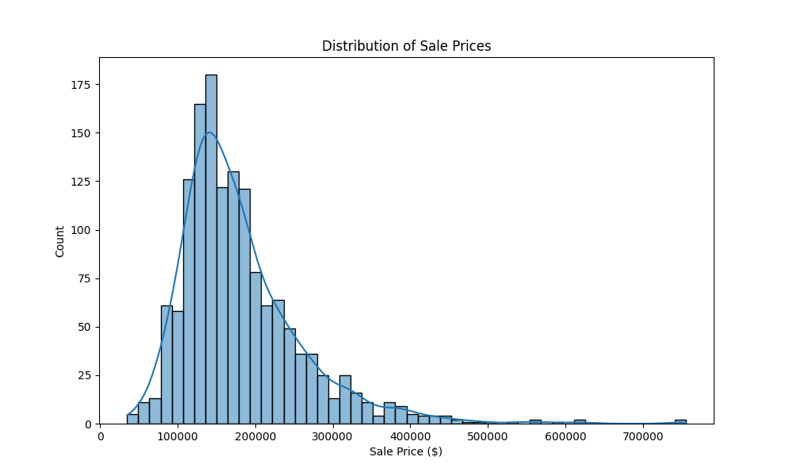
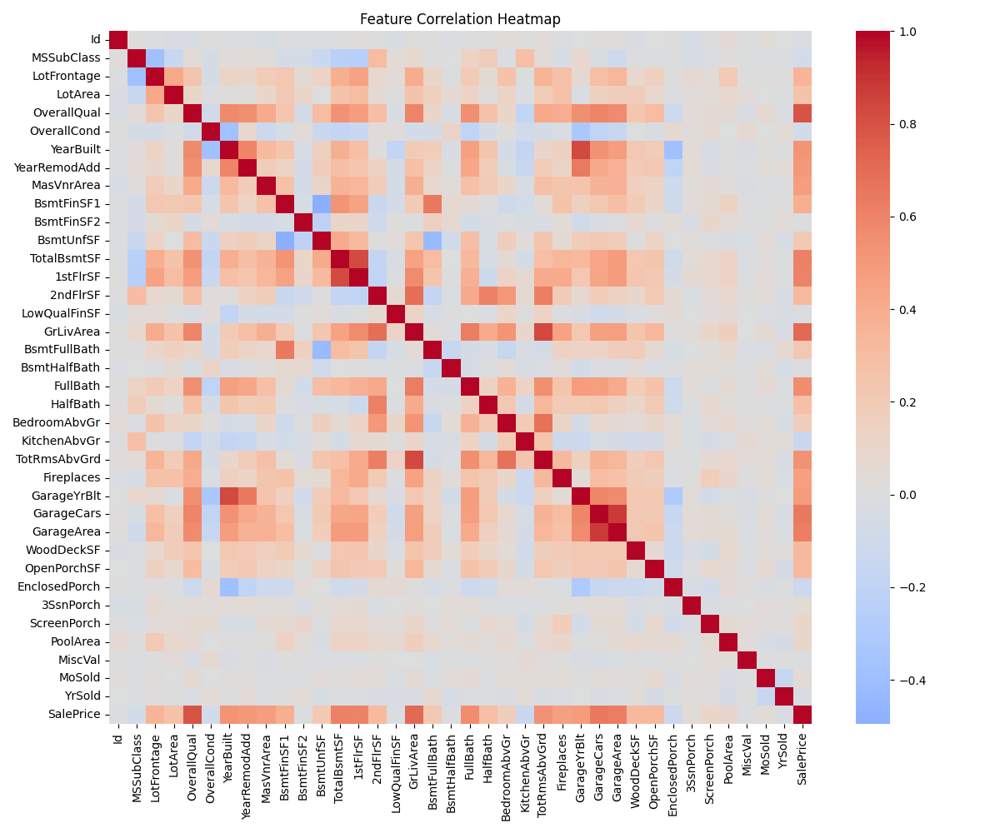
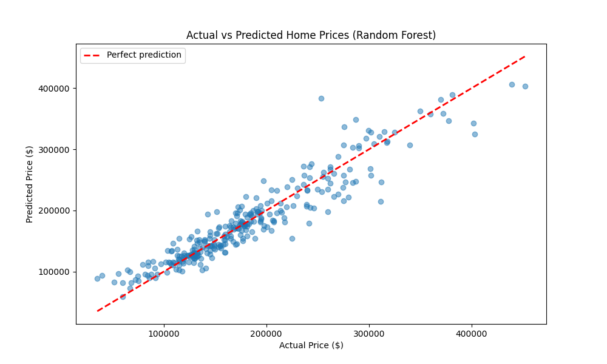

# 🏠 Home Price Predictor

A machine learning project that predicts residential home sale prices using the Ames Housing dataset. Built as a portfolio project to demonstrate data analytics and predictive modeling skills.

## 📊 Results

| Model | RMSE | R² Score |
|-------|------|----------|
| Linear Regression | $88,386 | -0.45 |
| Random Forest | $24,462 | 0.89 ⭐ |

The Random Forest model predicts home prices within ~$24,000 on average with 89% accuracy.

## 🔍 Key Findings

- **Overall Quality** is the strongest predictor of home price (correlation: 0.79)
- **Above Ground Living Area** is the second strongest predictor (correlation: 0.71)
- **Year Built**, **Garage Size**, and **Basement Size** are also strong predictors

## 📁 Project Structure
```
home-price-predictor/
├── data/               # Raw dataset from Kaggle
├── notebooks/          # Jupyter notebooks
│   ├── 01_exploratory_analysis.ipynb
│   ├── 02_data_cleaning.ipynb
│   └── 03_modeling.ipynb
├── visuals/            # Generated charts
└── README.md
```
## 🛠️ Tools Used

- Python, Pandas, NumPy
- Scikit-learn (Linear Regression, Random Forest)
- Matplotlib, Seaborn
- Jupyter Notebook

## 📈 Visualizations

### Sale Price Distribution


### Feature Correlation Heatmap


### Actual vs Predicted Prices


## 🚀 How to Run

1. Clone the repo
2. Install dependencies: `pip install -r requirements.txt`
3. Open notebooks in order: 01 → 02 → 03

## 📦 Dataset

[Ames Housing Dataset](https://www.kaggle.com/c/house-prices-advanced-regression-techniques) from Kaggle